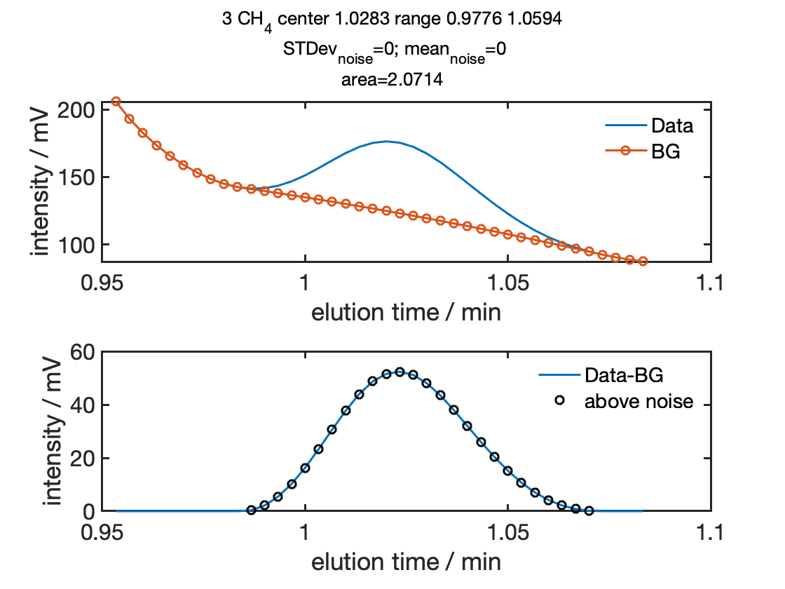
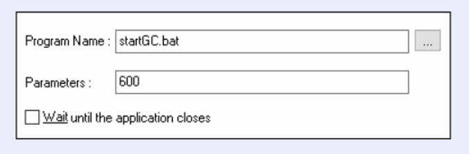

EC&amp;GC spectra analysis tool
=======================

The GC is triggered through EC-Lab:

The optional parameter is the time delay between calling startgc and triggering the GC. Under certain circumstances user activities can cancel the trigger process of the GC when occurring at the same time as the program (startgc) tries to trigger the GC.
In order to prevent this from happening startgc can block the user input during this brief moment. However, in order for this to actually work (block user input) both EC-Lab and startgc have to run under administrator privileges.
This can be achieved by right-click the program icon (the .exe file). Choose "Properties" and on the "Compatibility" tab, select the "Run This Program As An Administrator" option.

Gas flow rates are controlled by ALICAT flow controllers and recorded in EC-Lab through the analog inputs of the potentiostat.
The flow controller for the inlet gas flow is expected to be connected to channel 1 and the flow meter for the outlet flow rate (and inlet for the GC) is expected to be connected to channel 2.

**Authors**
  - Matthias Richter matthias.h.richter@gmail.com
