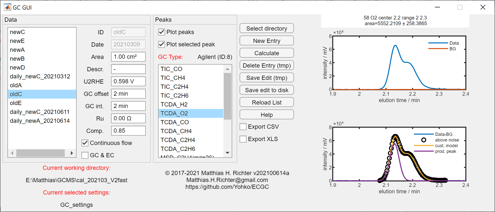
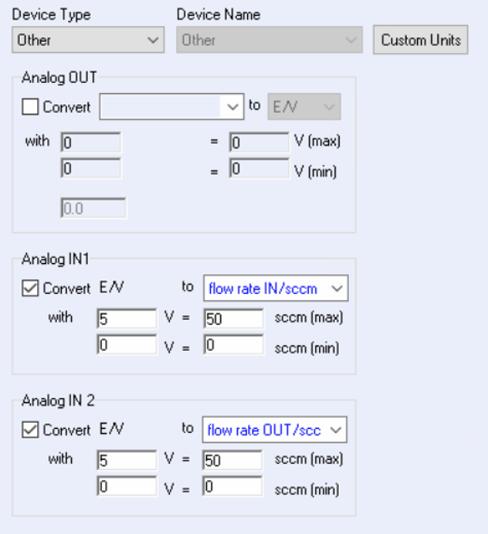

EC&amp;GC spectra analysis tool
=======================

Calculates faraday efficiency by evaluating electrochemistry, gas chromatography and gas flow measurements.

**Supported formats**:
  - Agilent MassHunter *.D (GC)
  - SRI PeakSimple *.asc (GC)
  - BioLogic EC-Lab *.mpt (EC)

Gas flow rates are controlled by ALICAT flow controllers and recorded in EC-Lab through the analog inputs of the potentiostat.
The flow controller for the inlet gas flow is expected to be connected to channel 1 and the flow meter for the outlet flow rate (and inlet for the GC) is expected to be connected to channel 2.

**Authors**
  - Matthias Richter matthias.h.richter@gmail.com
